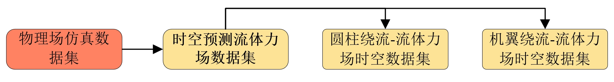
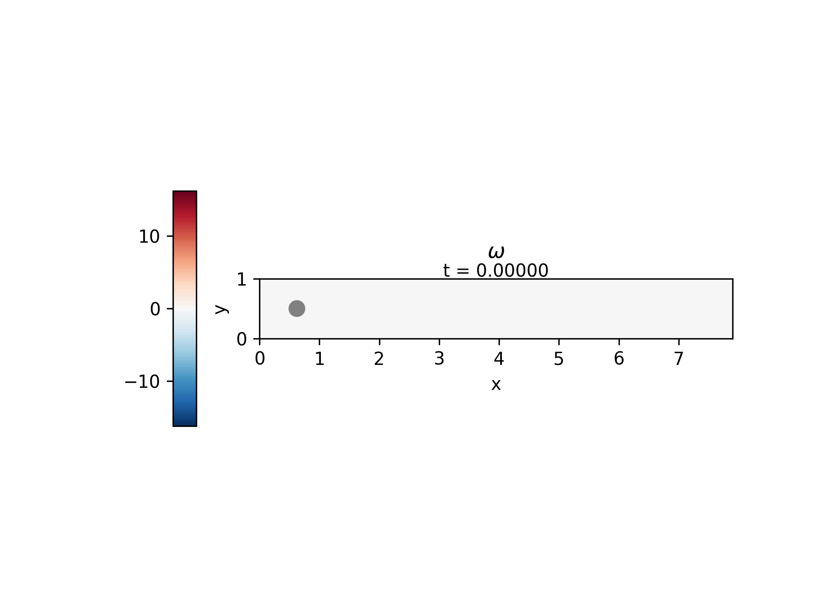
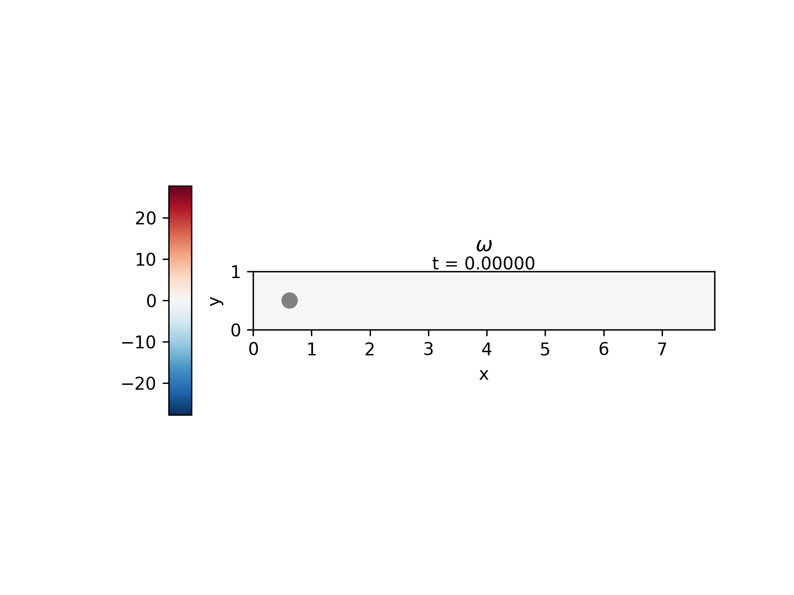
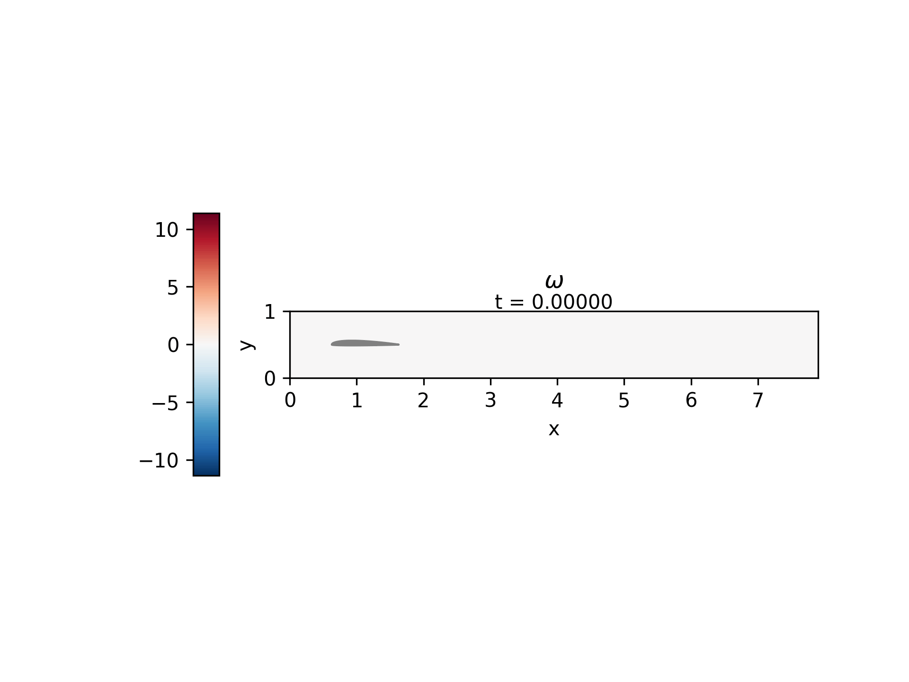

<h2 align="center" style="font-size: 30px"><b>物理场仿真数据集生成</b></h2>

# 数据集目录结构



🔄 链接表格

> 💡 **提示**：点击下方链接可快速定位到对应数据目录

|                     类别                      |              **目录链接**              |             **文件夹链接**              |
| :-------------------------------------------: | :------------------------------------: | :-------------------------------------: |
| [时空预测流体力场仿真数据集](#spatiotemporal) | [圆柱绕流-流体力场数据集](#st-circle)  | [👉跳转↗](./dynamic-spatiotemporal-flow) |
| [时空预测流体力场仿真数据集](#spatiotemporal) | [机翼绕流-流体力场数据集](#st-airfoil) | [👉跳转↗](./dynamic-spatiotemporal-flow) |
|                                               |                                        |                                         |


<a id="spatiotemporal"></a>

# 1 时空预测流体力场仿真数据集

<a id="st-circle"></a>

> 💡 **提示**：dynamic-spatiotemporal-flow文件夹下，flow_karma_gen.py和slover_karma.py是流体力场仿真数据集生成代码的python程序，flow_karma_gen.py使用python语言撰写的在GPU上运行的数据集生成代码，slover_karma.py是使用python语言撰写的在CPU上运行的数据集生成代码。
>
> 建议选择c语言版本的生成程序，可以有较快生成仿真速度。

## 1.1 圆柱绕流-流体力场时空仿真数据集

（1）圆柱绕流仿真数据集说明

圆柱绕流仿真数据集的通过仿真程序代码实现生成，代码文件可参考文件夹下的程序。的生成的数据集在唯一的变量雷洛数下进行多样例的设置，雷洛数的设置范围为[200, 1000]，每10个雷洛数间隔进行数据集的采集生成，总共得到80个数据集样例，每个样例中存在100个时序的流体力场数据。

（2）圆柱绕流数据集的可视化结果

上面动态图为雷洛数200条件下的圆柱绕流可视化。下面动态图在雷洛数为1000条件下的圆柱绕流可视化。





（3） 对圆柱绕流的数据集进行模型训练和物理场反演推理，总共选择了四种物理场反演模型进行包括扩散模型、流匹配模型、傅里叶神经算子和PINN模型，模型的动态时序预测实验结果如下表。

在NVIDIA显卡Tesla T4（16G）上进行训练，得到在训练过程中的数据均方误差指标值MSE。

|      模型      | 阶段 | MSE指标 |
| :------------: | :--: | :-----: |
|    扩散模型    | 训练 | 0.52840 |
| 傅里叶神经算子 | 训练 | 0.74070 |
|   流匹配模型   | 训练 | 0.32690 |
|    PINN模型    | 训练 | 0.89303 |

在NVIDIA显卡Tesla T4（16G）上进行测试验证，得到在测试过程中的数据均方误差指标值MSE。

|      模型      | 阶段 | MSE指标 |
| :------------: | :--: | :-----: |
|    扩散模型    | 测试 | 0.63953 |
| 傅里叶神经算子 | 测试 | 0.71769 |
|   流匹配模型   | 测试 | 0.27072 |
|    PINN模型    | 测试 | 0.88269 |

（4）对四个模型在端侧边缘计算模块中的推理效率测试汇总


（5）实现圆柱绕流的数据集生成的代码运行步骤

首先，将文件夹下的配置文件（包含障碍物配置文件和输入配置文件，都是txt文件）复制到config文件夹中；

其次，安装必要的依赖配置文件，在Linux系统的中查看系统中是否含有hdf5、eigen环境依赖。如果没有这两个环境依赖，需要进行安装环境才能够进行后续的编译和运行。安装命令如下：

安装hdf5环境：sudo apt install libhdf5-dev hdf5-helpers

安装eigen环境：sudo apt install libeigen3-dev

进一步，在文件makefile文件中替换这两个环境相应的环境所处的环境文件位置路径和仓库，替换makefile文件中相应的代码段。代码段展示如下所示。

```
# Libraries and paths
HDF5_DIR := /usr/include/hdf5/serial/   #replace your hdf5 location,it is locate the /usr/include
HDF5_LIB_DIR := /usr/lib/x86_64-linux-gnu/hdf5/serial # add the library dir
EIGEN_DIR := /usr/include/eigen3    #replace your eigen3 location,it is locate the /usr/include
LIBS := -lm -L$(HDF5_LIB_DIR) -lhdf5_cpp -lhdf5
INCLUDES := -I$(EIGEN_DIR) -I$(HDF5_DIR)
```

最后，在makefile所在的文件目录下创建和生成bin文件夹，bin文件夹用来进行存放编译链接后的代码文件。运行make makefile对数据集生成代码进行编译，会在bin文件夹中生成链接后的可运行文件main。通过bash运行main文件生成数据集完成。


<a id="st-airfoil"></a>

## 1.2 机翼绕流-流体力场时空仿真数据集

(1)  机翼绕流仿真数据集说明

机翼绕流仿真数据集的通过仿真程序代码实现生成，代码文件可参考文件夹下的程序。的生成的数据集在唯一的变量雷洛数下进行多样例的设置，雷洛数的设置范围为[200, 1000]，每10个雷洛数间隔进行数据集的采集生成，总共得到80个数据集样例，每个样例中存在100个时序的流体力场数据。

(2)  机翼绕流数据集的可视化结果

上面动态图为雷洛数200条件下的机翼绕流可视化。下面动态图在雷洛数为1000条件下的机翼绕流可视化。




（3)


（4）实现圆柱绕流的数据集生成的代码运行步骤


